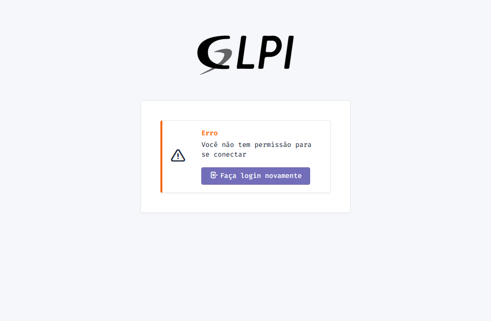
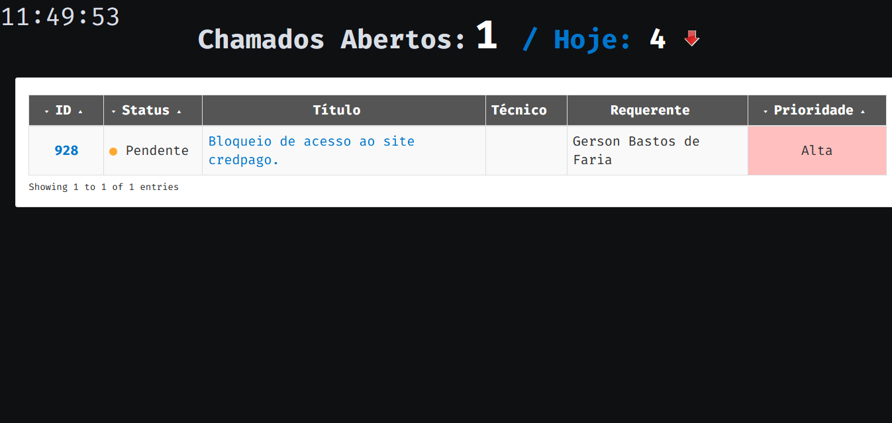
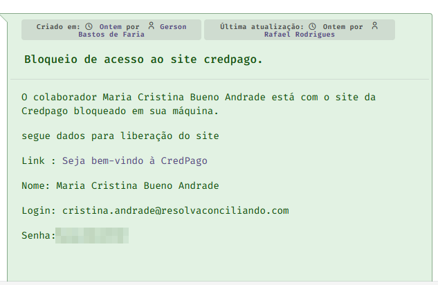

<!-- Title -->

<p align="center">
  <h2 align="center">GLPI</h2>
  <h1 align="center"></h1>

  # O que é o GLPI
  GLPI é um termo aplicado a um serviço de gerenciamento de ativos de TI, um sistema onde podemos integrar um controle de incidências de chamados e ativos em um [service desk](Dicionário.md), o mesmo é baseado em [código aberto](Dicionário.md) e escrito em [PHP](Dicionário.md) atribuído ao [GNU](Dicionário.md) (General Public License). Todo mundo sabe da importância do [helpdesk](Dicionário.md) nas empresas, é uma área cujo objetivo é dar suporte ao usuário nas soluções de problemas relacionados à TI. É uma área que necessita de um tempo de resposta rápido e exige uma eficiência nos atendimentos. O GLPI veio para organizar, molhorar e agilizar esse processo dentro da área [helpdesk](Dicionário.md).

  # Recursos GLPI
  O sistema GLPI oferece soluções eficientes para apoiar e atender as demandas específicas da sua empresa. Para isso ela dispões de algumas vantagens, a seguir iremos listar as principais vantagens do GLPI.

  1. Gestão de chamados
  - A gestão de chamados permite a criação, edição e exclusão de chamados, além de permitir visualizar as informações de cada chamado
  2. Gestão de usuários
  - A gestão de usuários permite gerenciar os dados dos usuários da empresa, como nome, endereço, telefone e e-mail. Também é possível cadastrar novos usuários dentro do sistema.
  3. Relacionamento com Usuário
  - Este módulo garante a interação com direta entre o suporte e o usuário, através do envio de mensagens personalizadas. Também é possível fazer o rastreamento dos chamados para indentificar problemas e soluções.
  4. Gestão financeira
  - A gestão financeira permite que você gerencie as licenças de [software](Dicionário.md), os orçamentos, fornecedores, contratos. Além de permitir que você rastreie suas despesas e faça relatórios para melhor ánalise.

  # Configuração e instalação
  Para realizar a instalação e a configuração usamos um arquivo [docker-compose.yml](Dicionário.md), dentro desse docker-compose podemos gerenciar múltiplos [containers](Dicionário.md). Por usarmos [containers](Dicionário.md) para gerenciar cada aplicação, caso alguma aplicação apresente alguma falha, conseguimos mapear qual arquivo apresentou essa falha e não interrompemos o sistema de chamados. Abaixo podemos ver como funciona o arquivo [docker-compose.yml](Dicionário.md):

  Este container roda o banco de dados
  ````
  version: "3.8"

services:
#Container do banco de dados
  mariadb:
    image: mariadb:10.7
    container_name: mariadb
    hostname: mariadb
    environment:
      - MARIADB_ROOT_PASSWORD=SENHA_ROOT
      - MARIADB_DATABASE=NOME_BANCO_DE_DADOS
      - MARIADB_USER=USUARIO_BANCO_DE_DADOS
      - MARIADB_PASSWORD=SENHA_GLPI
````

Este container roda a aplicação do sistema GLPI
````
#Container GLPI
  glpi:
    image: diouxx/glpi
    container_name : glpi
    hostname: glpi
    ports:
      - "80:80"
````
Para a instalação do GLPI, usamos uma máquina virtual com a distribuição [Ubuntu](Dicionário.md). Dentro do sistema operacional precisamos criar uma pasta para salvar o arquivo docker-compose.yml, com o seguinte comando:
````
sudo mkdir -p glpi
````
Para criar o arquivo, devemos usar este comando:
````
sudo nano docker-compose.yml
````
Agora devemos fazer o [deploy](Dicionário.md), usamos o seguinte comando:
````
sudo docker-compose up -d
````

Após fazer o deploy do arquivo, podemos acessar o sistema GLPI com a url definida. Caso não esteja hospedado em um domínio, você pode acessar o sistema pelo ip/localhost da máquina que está hospedado o sistema.

  # Acesso GLPI
  Todos os acessos do GLPI são sincornizados com o [Active Directory](Dicionário.md), todos os usuários da nossa rede tem um usuário dentro do GLPI, porém nem todos os usuários tem acesso ao sistema. Ao criar um usuário dentro do Active Directory, o GLPI importa os usuários e sincroniza as informações do usuário. Para que um usuário tenha acesso ao sistema GLPI, a equipe de tecnologia deve dar permissão/cargo para está pessoa no sistema, caso contrário irá apresentar a seguinte informação:



  # Quais as vantagens para a empresa?
  A maior vantagem que o GLPI nos dá, é o acompanhamento de chamados. Com GLPI caso aconteça algum imprevisto, por exemplo: Mouse com falhas, computador sem internet, etc. O funcionário com permissão poderá abrir um chamado relatando o problema e após abrir o chamado, a equipe de tecnologia consegue acompanhar pelo painel administrativo, segue imagem do painel:



Neste painel, a equipe de tecnologia tem acesso aos chamados e consegue acompanhar o que foi solicitado, conforme o print abaixo:




# Observações
Caso encontre alguma palavra que não conheça, verificar se a palavra se encontra no [Dicionário](Dicionário.md), caso a palavra não esteja no dicionário disponibilizado, por favor relatar para a equipe de TI.

# Autores
- **Cleiton Lemos** - _CTO_ - <cleiton.lemos@validu.com.br>
- **Nicolas Saldanha Alves** - _Estagiário Analista de Sistemas_ - <nicolas@camecsp.com.br>
- **Rafael Rodrigues Gomes** - _Analista de Infraestrutura_ - <rafael@camecsp.com.br>