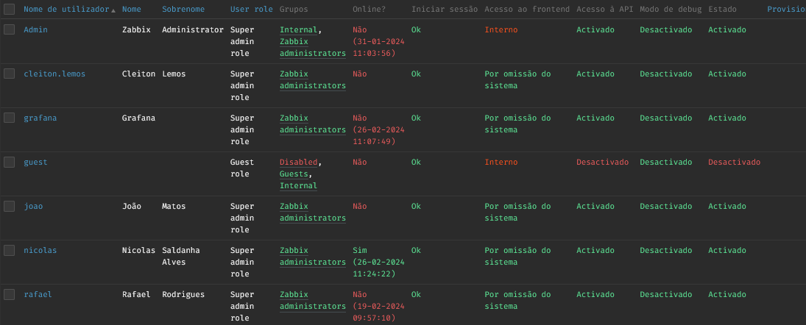
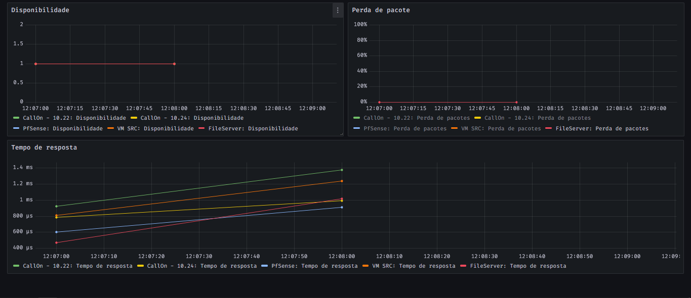

<!-- Title -->

<p align="center">
  <h2 align="center">Zabbix</h2>
  <h1 align="center"></h1>

  # O que é o Zabbix?
  O Zabbix é uma ferramenta de software que monitora a infraestrutura de TI, como redes, servidores, máquinas virtuais e serviços em nuvem no geral.

  O mesmo utiliza-se de um mecanismo flexível de notificação que permite configurar alertas por e-mail para praticamente qualquer evento.

  Zabbix é livre de custos. É desenvolvido e distribuido através da licença pública [GPLv2](/Guia/Dicionário.md). Isso garante que seu código-fonte seja deistribuído e esteja disponível para o público em geral.

# Recursos Zabbix
<P> Zabbix é uma solução de monitoração integrada, que provê diversos recursos de monitoração em um único pacote. Abaixo as principais funcionalidades do Zabbix.

1. A coleta de dados
- Verificação de disponibilidade e desempenho.
- Suporta [SNMP](/Guia/Dicionário.md).
- Verificações personalizadas.
- Coleta de dados com intervalos personalizados, inclusive com agendamento exato de momento da coleta (Ex. 11:45 de uma segunda-feira).
- A coleta pode ser executada pelo servidor, proxy ou pelos agentes.

2. Histórico e armazenamento de dados
- Os dados são armazenados em banco de dados.
- O histórico é configurável.
- Processo interno de limpeza de dados antigos.

3. Sistema de permissões
- Autenticação segura dos usuários.
- Determinados usuários podem ser limitados a visualizar subconjuntos de funções e de [hosts](/Guia/Dicionário.md) monitorados.

4. Configuração simplificada
- Todo elemento monitorado é um host.
- Hosts são monitorados assim que inseridos no banco de monitoração
- É possível utilizar perfis de monitoração ([templates](/Guia/Dicionário.md)) aos dispositivos monitorados ([hosts](/Guia/Dicionário.md)).

# Configuração e instalação

Para realizar a instalação e a configuração do Zabbix, devemos adicionar o repositório dentro do nosso sistema operacional, usando o comando em evidência abaixo.
````
#Este comando wget é usado para instalar o repositório dentro do sistema operacional
wget https://repo.zabbix.com/zabbix/6.4/ubuntu/pool/main/z/zabbix-release/zabbix-release_6.4-1+ubuntu22.04_all.deb

# Comando para desempacotar os arquivos 
dpkg -i zabbix-release_6.4-1+ubuntu22.04_all.deb

# Comando para atualizar os pacotes disponíveis a partir dos repositórios configurados
apt update 
````

Após fazer a instalação do repositório devemos instalar o servidor, o [frontend](/Guia/Dicionário.md) e o agente Zabbix em seguida.
````
# Comando para instalação do servidor, frontend e agente
apt install zabbix-server-mysql zabbix-frontend-php zabbix-apache-conf zabbix-sql-scripts zabbix-agent
````
Agora é necessário criar um banco de dados, para que isso seja possível devemos executar os seguintes comandos em seu host de banco de dados.
````
# Comando para acessar o MySql
mysql -uroot -p
password (Senha para acesso)

# Criar o banco de dados
mysql> create database zabbix character set utf8mb4 collate utf8mb4_bin;

# Criar o usuário e a senha
mysql> create user zabbix@localhost identified by 'SENHA';

#Garantir os acessos ao usuário
mysql> grant all privileges on zabbix.* to zabbix@localhost;

# Este comando é usado para definir a variável global log_bin_trust_function_creators no MySQL.
mysql> set global log_bin_trust_function_creators = 1;

#Sair
mysql> quit; 
````

Após as configurações iniciais dentro do nosso sistema operacional, precisamos iniciar o servidor Zabbix e os processos do agente.
````
# Comando para reiniciar e iniciar o servidor e o agente
systemctl restart zabbix-server zabbix-agent apache2
systemctl enable zabbix-server zabbix-agent apache2
````

Conforme mostrado, todos os usuários e todas as permissões são criados dentro de um banco de dados, garantindo a proteção dos dados e a proteção dos serviços. Todos os processos estão dentro de máquinas virtuais, com estes processos em máquinas virtuais temos a certeza que a manutenção, caso necessário, será feita de uma maneira mais eficaz e vantajosa.


# Acesso ao Zabbix

Os acessos ao sistema Zabbix são criados e configurados pela nossa equipe de tecnologia, cada usuário escolhe a própria senha, garantindo uma proteção maior dentro do sistema. A autenticação é feita pelo protocolo LDAP, passando pelo nosso sistema interno e após o sistema dar OK, é feito o login do usuário.

Dentro do sistema Zabbix, podemos monitorar qual permissão, quando foi o último acesso e se o usuário está apto para iniciar a sessão dentro do Zabbix.



# Quais as vantagens para a empresa?

A maior vantagem que temos ao usar o Zabbix, é monitorar qualquer aplicação que temos em nossa empresa ou fora. Por exemplo, podemos monitorar a nossa internet, como mostra a imagem abaixo.



Conforme a imagem fornecida, podemos notar 3 pontos importantes para o monitoramento. 


1. Disponibilidade - A disponibilidade é feita por 1 ou 0. 1 = DISPONÍVEL e 0 = INDISPONÍVEL
2. Perda de pacote - A perda de pacote é feita com o serviço [ICMPPINGLOSS](/Guia/Dicionário.md)
3. Tempo de resposta - O tempo de resposta é feito com o serviço [ICMPPINGSEC](/Guia/Dicionário.md)

Usando esses protocolos de monitoramento dentro do Zabbix, conseguimos analisar e mitigar os riscos e resolver os problemas com um tempo de resposta mais rápido e eficaz.

# Autores
- **Cleiton Lemos** - _CTO_ - <cleiton.lemos@validu.com.br>
- **Nicolas Saldanha Alves** - _Estagiário Analista de Sistemas_ - <nicolas@camecsp.com.br>
- **Rafael Rodrigues Gomes** - _Analista de Infraestrutura_ - <rafael@camecsp.com.br>

