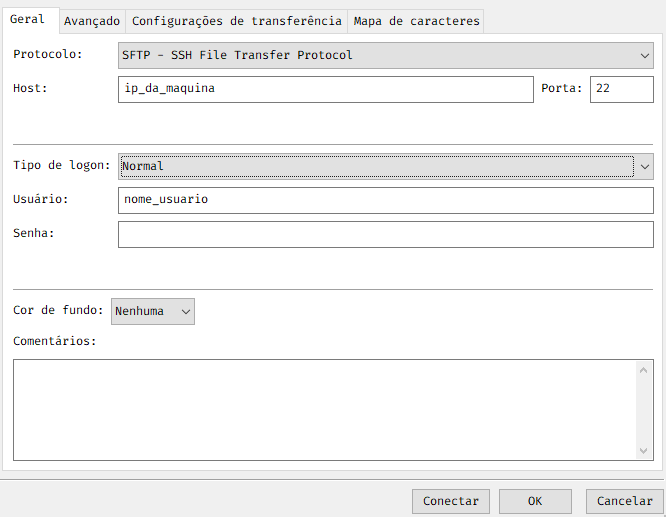

<!-- Title -->

<p align="center">
  <h2 align="center">sFTP</h2>
  <h1 align="center">

  # Trânsferencia de arquivos
  Nos tempos atuais, a trânsferencia de arquivos é completamente útil no mundo empresarial, o uso do método de trânferencia de arquivos é muito necessário, para que, multiusuários tenham acesso as mesmas informações de diferentes locais.

  Para realizar estas trânferencias, nós resolvemos criar um servidor próprio com o uso do protocolo sFTP, que conta com uma proteção maior na hora de transferir os arquivos, internamente ou externamente.

  Mas antes de entendermos como funciona o protocolo sFTP, devemos entender como funciona o protocolo que originou o sFTP, precisamos entender como funciona e como surgiu o protocolo FTP. 

  ## O que é FTP?
  Desenvolvido em 1971 pelo estudante de engenharia elétrica Abhay Bhushan, o File Transfer Protocol (FTP), é um tipo de mensageiro, ou seja, ele transporta arquivos entre computadores pela internet. 

  O FTP é baseado no [TCP](Dicionário.md), mas é anterior à pilha de protocolos [TCP/IP](Dicionário.md), sendo posteriormente adaptado a este. É o padrão da pilha para transferir arquivos.

  O protocolo é especificado na [RFC](Dicionário.md) 959, podemos acessar o resumo neste link [resumo](https://pt.wikipedia.org/wiki/Protocolo_de_Transfer%C3%AAncia_de_Arquivos#Vis%C3%A3o_geral_do_protocolo) 

  ## Como funciona o FTP?
  A conexão FTP precisa de duas partes para estabelecer e se comunicar na rede. Para fazer isso, os usuários precisam de obter permissão ao fornecer as credenciais para o servidor FTP.

  Qualquer computador pode ser usado como um servidor FTP, conquanto hoje em dia seja mais usado por administrador de sites, que usam a conexão e um sistema de hospedagem para manter os dados de suas páginas.

  Seu principal papel é fazer o transporte de arquivos entre servidores locais, mas ele também troca correspondências entre a internet e as redes domésticas.

  ## O protocolo é seguro?
  O FTP tem aproximadamente 50 anos e, por isso, não conta com diversos padrões de seguranças que temos hoje em dia, e por isso foi necessário adicionar métodos de proteção para as trânsferencias de arquivos, como o protocolo sFTP.

  # O que é sFTP?
  O sFTP é um protocolo de transferência de arquivos que aproveita um conjunto de utilitários que fornecem acesso seguro a um computador remoto para fornecer comunicações seguras. É considerado por muitos como o método ideal para transferência segura de arquivos. Ele aproveita o [SSH](Dicionário.md) (Secure Shell) e é frequentemente também chamado de 'Secure Shell File Transfer Protocol'
  ## Como surgiu?
  O FTP seguro surgiu para atender às necessidades de segurança reforçada com túneis. Ele usa o [Secure Shell](Dicionário.md) 2 (SSH2), um protocolo de tunelamento seguro, para emular uma conexão FTP e fornece um canal amigável e criptografado para transferências de arquivos usando a conhecida Porta [TCP](Dicionário.md) 22.

  ## Segurança SSH
  O [SSH](Dicionário.md) oferece segurança aprimorada, tendo toda a sessão de transferência de arquivos, incluindo todos os comandos de controle de sessão, totalmente criptografados em todos os momentos, exigindo apenas que uma única porta seja aberta em seu [firewall](Dicionário.md) versus as duas portas que precisam a ser aberto para conexões FTP e [SSL](Dicionário.md).

  Como recurso adicional, o Secure FTP também comprime todos os dados durante a transmissão, o que pode resultar em transferências mais rápidas de arquivos. Além disso, permite a padronização de TI entre plataformas, o que garante uma aplicação consistente e forte da política de segurança e administração mais simples.

  # Servidor sFTP
  O servidor sFTP pode ser criado em qualquer computador que tenha acesso à internet, como informado anteriormente. Para a criação do servidor, utilizamos o [sistema operacional](Dicionário.md) [Ubuntu](Dicionário.md), que  já vem com a ferramenta [OpenSSH](Dicionário.md) instalado por padrão.

  ## Criação do servidor
  Nesta seção do documento iremos explicar como foi feita a instalação e a configuração do servidor sFTP.

  Primeiramente devemos deixar o nosso [sistema operacional](Dicionário.md) atualizado, para que não ocorra nenhum erro na parte da instalação e na parte da configuração. Entrar no [terminal](Dicionário.md) e digitar o comando para está operação:

  ````
  sudo apt-get update && apt-get upgrade -y
  ````

  Após a atualização do [sistema operacional](Dicionário.md), devemos criar um grupoo dentro do nosso servidor e criar os usuários que pertencem a este grupo.

  ````
  # Grupo para certificar os usuários
  # dentro do serviço sftp
  sudo grupoadd sftp_certificacoes
  ```` 
Assim que criar o grupo que irá certificar o usuário dentro do serviço, podemos criar os usuários dentro do grupo criado anteriormente.

````
# A pasta raiz é a pasta que vai ficar todos os diretórios da pessoa
# Sempre lembrar o nome que você colocou e diferente do nome de usuário

sudo useradd -g sftp_certificacoes -d /pasta_raiz_do_usuario -s /sbin/nologin nome_usuario
````
Agora devemos criar a pasta aonde vai ficar todos os diretórios, para demonstração vamos criar uma pasta chamada sftp, com este comando:
````
# Lembrar aonde fica o caminho da pasta, para não ocorrer erros em outras criações

cd /

mkdir -p /sftp
````
Para que o usuário consiga acessar o serviço, devemos colocar uma senha para ele/a, com o seguinte comando:
````
passwd nome_usuario
````
No [terminal](Dicionário.md) você deverá digitar a senha e confirmar a senha.

Neste momento, devemos configurar o arquivo do nosso servidor sFTP. Abaixo o código e o arquivo de exemplo:
````
sudo nano /etc/ssh/sshd_config
```` 

Ao entrar no arquivo, comente a linha:
````
#Subsystem  sftp /usr/libexec/openssh/sftp-server
````
Após isso precisará adicionar algumas informações para a liberação e configuração do sFTP no final do arquivo. Adicione o conteúdo abaixo no arquivo:
````
# Configuracao do server
Match Group sftp_certificacoes
        ChrootDirectory /sftp/%u
        ForceCommand internal-sftp
````
Após adicionar essa configuração no arquivo, salvar e sair.

Agora devemos criar a pasta de acesso do usuário, segue comando abaixo:

````
sudo mkdir -p /sftp/nome_usuario/pasta_raiz_do_usuario
````

Após a criação da pasta de acesso do usuário, precisamos dar a permissão de leitura, escrita e gravação para o usuário, digite:
````
chown nome_usuario:sftp_certificacoes /sftp/nome_usuario/pasta_raiz_do_usuario/
````

Agora que configuramos todos os acessos e instalarmos o serviço, podemos rodar o seguinte comando no [terminal](Dicionário.md):
````
systemctl restart sshd
````

Assim que o serviço reinicar, podemos acessar a pasta sftp com o programa que você preferir, neste exemplo estamos usando o [FileZilla](Dicionário.md). Segue print abaixo:



Caso não saiba o [ip](Dicionário.md) da máquina, abra o [terminal](Dicionário.md) e use o comando: ifconfig

# Observações
Caso encontre alguma palavra que não conheça, verificar se a palavra se encontra no [Dicionário](Dicionário.md), caso a palavra não esteja no dicionário disponibilizado, por favor relatar para a equipe de TI.

# Autores
- **Cleiton Lemos** - _CTO_ - <cleiton.lemos@validu.com.br>
- **Nicolas Saldanha Alves** - _Estagiário Analista de Sistemas_ - <nicolas@camecsp.com.br>
- **Rafael Rodrigues Gomes** - _Analista de Infraestrutura_ - <rafael@camecsp.com.br>